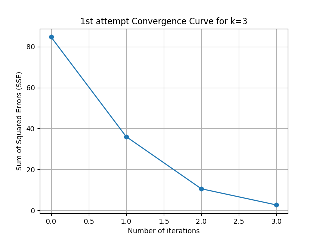
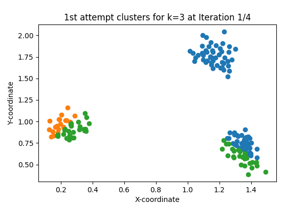
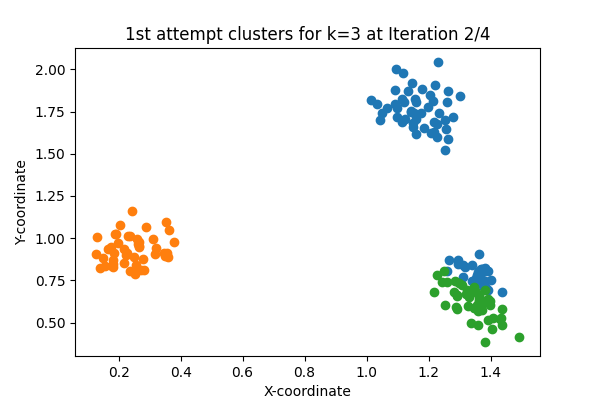
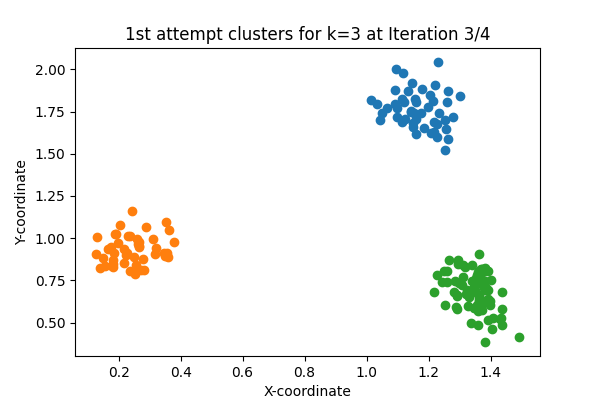
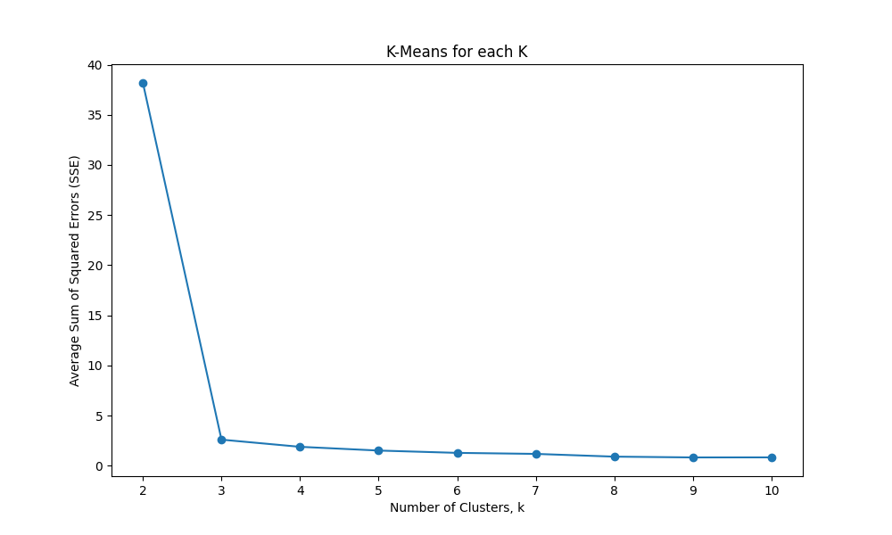
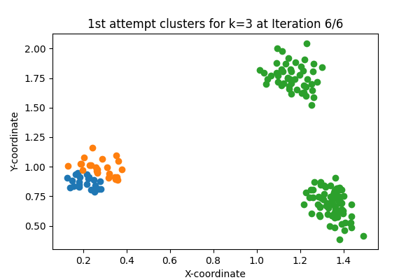
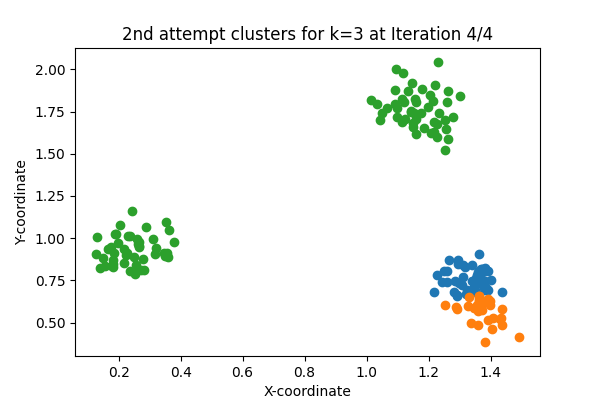
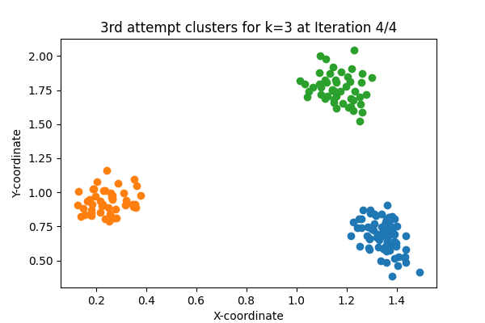

# K-Means Clustering Analysis README

## Instructions

### Experiment 1
Run the algorithm with `K=3`, calculating the Sum of Squared Error (SSE) at the end of each iteration of cluster membership assigning followed by centroid updating. Plot the SSE against the number of iterations to observe the convergence curve. Question to consider: Does the SSE monotonically decrease when the number of iterations grows?

### Experiment 2
Run the algorithm with different choices of K’s (ranging from 2 to 10 with step size 1). Calculate the SSE for clustering resulted from each run, and plot SSE against K. Note: For each K, multiple runs with different initial centroids may be needed.

### Experiment 3
Run the algorithm with `K=3`. Show the clustering results in a figure with varying colors or shapes of data points to represent different cluster assignments. Note: Multiple runs may be needed to obtain a satisfactory clustering result.

## Discussion

### Experiment 1
The convergence criteria is Euclidean distance and the number of maximum iterations is set to 10. The K-means algorithm's effectiveness is indicated by a monotonically decreasing SSE. However, initial point choice significantly influences the first iteration's outcomes.

*Figure 1: Convergence Curve for k=3*

*Figure 2: 1st iteration*

*Figure 3: 2nd iteration*

*Figure 4: 3rd iteration*

### Experiment 2
Observations show a monotonically decreasing SSE as K increases, which may indicate over-clustering. However, visual inspection suggests only 3 distinct clusters in the data.

*Figure 5: SSE plotted against each K*

### Experiment 3
Multiple runs of K-means with different initial centroids illustrate how varied initial points can lead to different convergence results, sometimes achieving the global optimum.

*Figure 6: 1st attempt, last iteration*

*Figure 7: 2nd attempt*

*Figure 8: 3rd attempt*

## Conclusion
This analysis demonstrates the importance of initial centroid selection in K-means and its impact on the algorithm's performance and clustering outcomes.
